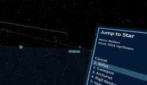
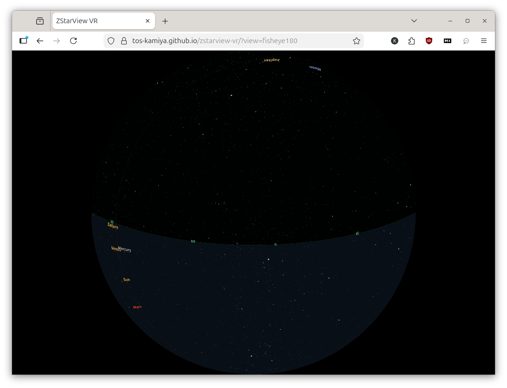

# zstarview-vr

Experimental WebXR port of the AI-assisted Python sky viewer “zstarview”.

Try `zstarview-vr` on GitHub Pages (for Quest 3 and other supported devices/browsers):

https://tos-kamiya.github.io/zstarview-vr/

This repository represents a milestone snapshot of an ongoing migration
from a desktop Python/Qt application to a browser-based immersive prototype.

Original desktop application:  
https://github.com/tos-kamiya/zstarview (Python/Qt version)

## Quick Links

- Default:
  - [Open default URL](https://tos-kamiya.github.io/zstarview-vr/)
- Extended stars (`maxMag=7`):
  - [Open with `maxMag=7`](https://tos-kamiya.github.io/zstarview-vr/?maxMag=7)
- Extended stars (`maxMag=8`):
  - [Open with `maxMag=8`](https://tos-kamiya.github.io/zstarview-vr/?maxMag=8)
- Extended stars (`maxMag=9`):
  - [Open with `maxMag=9`](https://tos-kamiya.github.io/zstarview-vr/?maxMag=9)
- Extended stars (`maxMag=10`):
  - [Open with `maxMag=10`](https://tos-kamiya.github.io/zstarview-vr/?maxMag=10)
  - Note: due to extremely large data size, this mode is provided mainly for benchmarking rather than practical use.

Major cities (about 20):

- [Tokyo, JP](https://tos-kamiya.github.io/zstarview-vr/?city=Tokyo&country=JP)
- [Osaka, JP](https://tos-kamiya.github.io/zstarview-vr/?city=Osaka&country=JP)
- [Matsue, JP](https://tos-kamiya.github.io/zstarview-vr/?city=Matsue&country=JP)
- [Seoul, KR](https://tos-kamiya.github.io/zstarview-vr/?city=Seoul&country=KR)
- [Beijing, CN](https://tos-kamiya.github.io/zstarview-vr/?city=Beijing&country=CN)
- [Shanghai, CN](https://tos-kamiya.github.io/zstarview-vr/?city=Shanghai&country=CN)
- [Taipei, TW](https://tos-kamiya.github.io/zstarview-vr/?city=Taipei&country=TW)
- [Singapore, SG](https://tos-kamiya.github.io/zstarview-vr/?city=Singapore&country=SG)
- [Bangkok, TH](https://tos-kamiya.github.io/zstarview-vr/?city=Bangkok&country=TH)
- [Delhi, IN](https://tos-kamiya.github.io/zstarview-vr/?city=Delhi&country=IN)
- [Dubai, AE](https://tos-kamiya.github.io/zstarview-vr/?city=Dubai&country=AE)
- [Cairo, EG](https://tos-kamiya.github.io/zstarview-vr/?city=Cairo&country=EG)
- [London, GB](https://tos-kamiya.github.io/zstarview-vr/?city=London&country=GB)
- [Paris, FR](https://tos-kamiya.github.io/zstarview-vr/?city=Paris&country=FR)
- [Berlin, DE](https://tos-kamiya.github.io/zstarview-vr/?city=Berlin&country=DE)
- [Istanbul, TR](https://tos-kamiya.github.io/zstarview-vr/?city=Istanbul&country=TR)
- [New York, US](https://tos-kamiya.github.io/zstarview-vr/?city=New%20York&country=US)
- [Los Angeles, US](https://tos-kamiya.github.io/zstarview-vr/?city=Los%20Angeles&country=US)
- [Mexico City, MX](https://tos-kamiya.github.io/zstarview-vr/?city=Mexico%20City&country=MX)
- [Sao Paulo, BR](https://tos-kamiya.github.io/zstarview-vr/?city=Sao%20Paulo&country=BR)

## Screenshots & Video

**Quest 3 -- Video Capture (YouTube)**

**Desktop web browser**

## Usage (VR Mode)

1. Open:
   - https://tos-kamiya.github.io/zstarview-vr/
2. Optionally specify location in URL:
   - `?lat=35.465&lon=133.051`
   - `?city=Tokyo`
   - `?city=Matsue&country=JP`
3. Start VR:
   - Press `Enter VR`.
   - A location splash appears in front of the user for about 3 seconds.
4. While immersed:
   - On Quest 3, the Menu button on either controller toggles a gray world-anchored menu panel. The panel appears slightly to the left or right of your forward view depending on which controller opened it. Press the Menu button again to close it; the panel also closes automatically when you exit VR.
   - Desktop users may toggle the same panel with the `M` key for preview/testing without entering a headset.
Location resolution priority:

1. `lat` + `lon` (if valid)
2. `city` (lazy-loaded city index lookup)
3. default (`Tokyo`)

If `city` is not found (or city index loading fails), the app falls back to default (`Tokyo`) and explicitly shows the fallback reason in status/splash text.
If `country` is also specified, city lookup is filtered by that country code (ISO 3166-1 alpha-2, e.g. `JP`, `US`).

## Feature: VR Menu / Jump to Star

The VR variant keeps the existing interaction model ("the user turns to face the target") and does not forcibly rotate the sky.

- **Entry point**: Press the Menu button on either VR controller (or `M` on desktop) to open the menu.
- **Top level**: The menu currently contains `Jump to Star` and `About`.
- **Hover and select**: In VR, point at a menu item to hover it, then press the trigger to activate it. Hover and selected states are drawn differently.
- **Jump to Star behavior**:
  - When the star list first opens, no star is selected yet.
  - While no star is selected, the arc and target marker follow the star currently hovered in the menu.
  - After pressing the trigger on a star, that star becomes the active selection and the arc/marker stay locked to it until the menu is closed.
- **Exit Menu**: Press the Menu button again to close the menu. Closing the menu clears the current Jump to Star selection.

## Feature: Asterism Overlay (Imported from zstarview)

- Asterisms are always shown as dim ambient lines, and pointing at a famous star brightens the matching pattern.
- If multiple asterisms share the same star, the overlay rotates every 3 seconds.
- Asterism definitions are imported in HIP/source-id form to match zstarview data.

Imported asterisms:

- Winter: `Winter Triangle`, `Orion's Belt`, `Winter Hexagon`, `Southern Cross`, `Southern Pointers`, `Diamond Cross`, `False Cross`
- Spring: `Big Dipper`, `Little Dipper`, `Spring Triangle`, `Arc to Arcturus`, `Leo Sickle`, `Southern Triangle`
- Summer: `Summer Triangle`, `Northern Cross`, `Teapot`, `Keystone`
- Autumn: `Great Square of Pegasus`, `Circlet of Pisces`, `Water Jar of Aquarius`, `Cassiopeia W`, `House of Cepheus`, `Job's Coffin`

## Usage (Desktop Mode)

1. Open with `?view=fisheye180`:
   - https://tos-kamiya.github.io/zstarview-vr/?maxMag=10&view=fisheye180
2. Use arrow keys:
   - `←/→` for azimuth
   - `↑/↓` for altitude

## License

This project is licensed under the MIT License.

- [LICENSE](./LICENSE)

Data source licenses (inherited from zstarview dataset sources):

- City names (`data/cities1000.txt`): GeoNames dump  
  Source: https://download.geonames.org/export/dump/  
  License: CC BY 4.0 (https://creativecommons.org/licenses/by/4.0/)
- Star catalog (source for generated star data): Hipparcos and Tycho Catalogues (ESA 1997), plus Tycho-2 Catalogue (Hog et al. 2000), via CDS Strasbourg  
  Source (Hipparcos/Tycho): https://cdsarc.cds.unistra.fr/ftp/I/239/  
  Source (Tycho-2): https://cdsarc.cds.unistra.fr/ftp/I/259/  
  License note in zstarview: ODbL or CC BY-NC 3.0 IGO (non-commercial)
- Deep-sky objects (`public/data/dso.csv`): OpenNGC via PyOngc  
  Source: https://github.com/mattiaverga/OpenNGC  
  License: CC BY-SA 4.0

## Developer Notes

For build/development/setup details, see:

- [DEVELOPER_NOTES.md](./DEVELOPER_NOTES.md)

## Acknowledgements

This project was developed with assistance from Google Gemini 3 and OpenAI GPT-5 (Codex).
